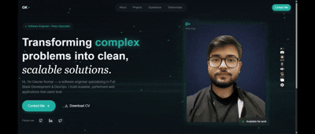

# 🌐 My Portfolio 

A modern, responsive and production-ready **personal portfolio** built to showcase projects, skills and experience with **smooth UI interactions** and **clean architecture**.

### 🔗 [Check Live Portfolio ](https://portfolio-gaurav-dev.vercel.app/)
👨‍💻 Author: Gaurav Kumar

---

## 🔗 Live Demo (GIF)


## ✨ Key Features
- ⚛️ Built with **React**
- 🔀 Client-side routing using **React Router DOM**
- 🧩 **Dynamic routing with `<Outlet />`**
- 📱 Fully responsive design
- 🎨 Modern UI/UX with **Tailwind CSS**
- 📩 Downloadable resume
- 📧 Contact form with email integration
- 👌 Animated sections & transitions
- 🚀 Clean and scalable code structure

---

## 🛠️ Tech Stack
 ### Frontend: 
- React (Vite)
- Tailwind CSS
- JavaScript (ES6+)

### Routing: 
- React Router DOM

### Icons: 
- Lucid-React Icons

### Email Integration: 
- EmailJS

### Deployment: 
- Vercel

---

## 📁 Folder Structure
```bash
my-portfolio/
├── public/  # images, icons, static files
├── src
    ├── assets        
    ├── components    # reusable UI components
    │    ├── Button.jsx
    │    └── AnimatedBorder.jsx
    │
    ├── layout        # layout wrappers
    │    ├── Navbar.jsx
    │    └── Footer.jsx
    │
    ├── sections      # main page sections
    │    ├── Hero.jsx
    │    ├── About.jsx
    │    ├── Experience.jsx
    │    ├── Projects.jsx
    │    ├── Testimonials.jsx
    │    └── Contact.jsx
    │
    ├── App.jsx
    ├── main.jsx
    └── index.css
```
---

## 🚀 Getting Started
### 1️⃣ Clone the repository
```bash
git clone https://github.com/KumarGaurav007/My-Portfolio.git

cd My-Portfolio
```
### 2️⃣ Install dependencies
```bash
npm install
```
### 3️⃣ Setup environment variables
```bash
VITE_EMAILJS_SERVICE_ID=your_service_id
VITE_EMAILJS_TEMPLATE_ID=your_template_id
VITE_EMAILJS_PUBLIC_KEY=your_public_key
```
### 4️⃣ Run the local server
```bash
npm run dev
```
---

## 📨 Contact Form
The contact form uses **EmailJS** to send messages directly to your email without a backend server. Make sure to set up your EmailJS account and configure the service, template, and public key in the `.env` file.

---

## 🔮 Future Improvements
- Dark mode toggle
- Blog section integration
- More animations and interactive elements
- SEO optimization
- Analytics tracking
- Multi-language support

---

## 📄 License
This project is licensed under the MIT License.

---

## 🧑‍💻 Author

**Gaurav Kumar** <br>
🎓 B.Tech in Computer Science & Engineering<br>
💡 Learning React through practical implementation & consistency<br>
💡 Passionate about Artificial Intelligence, Software Development, and Full Stack Projects<br>
📧 LinkedIn: [Gaurav Kumar](https://www.linkedin.com/in/gaurav-kumar-25-oct?lipi=urn%3Ali%3Apage%3Ad_flagship3_profile_view_base_contact_details%3BW7%2FB5onwS4yNaZXl9gxzoA%3D%3D)<br>
GitHub: [KumarGaurav007](https://github.com/KumarGaurav007)

### ⭐ If you like this project, don’t forget to star the repo!